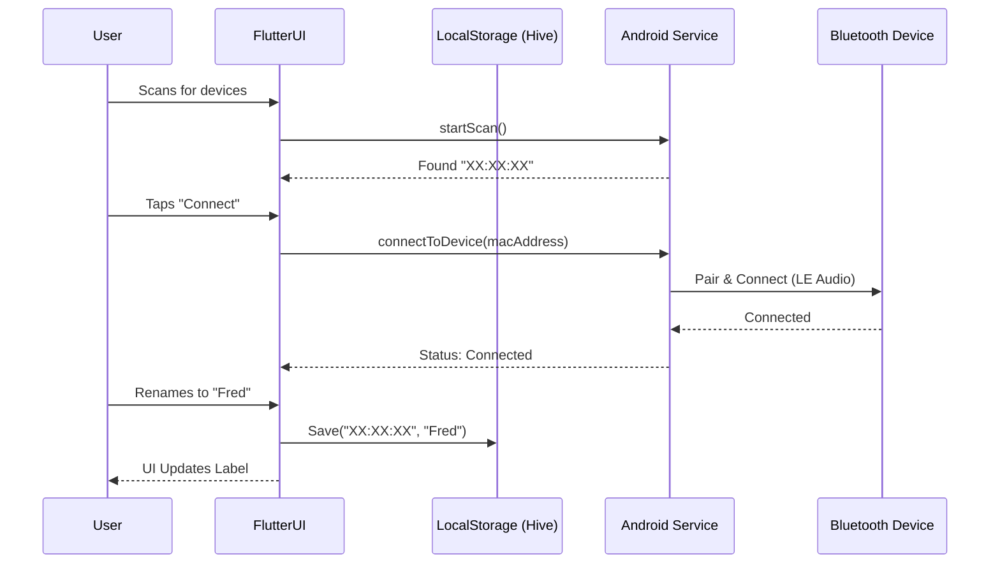
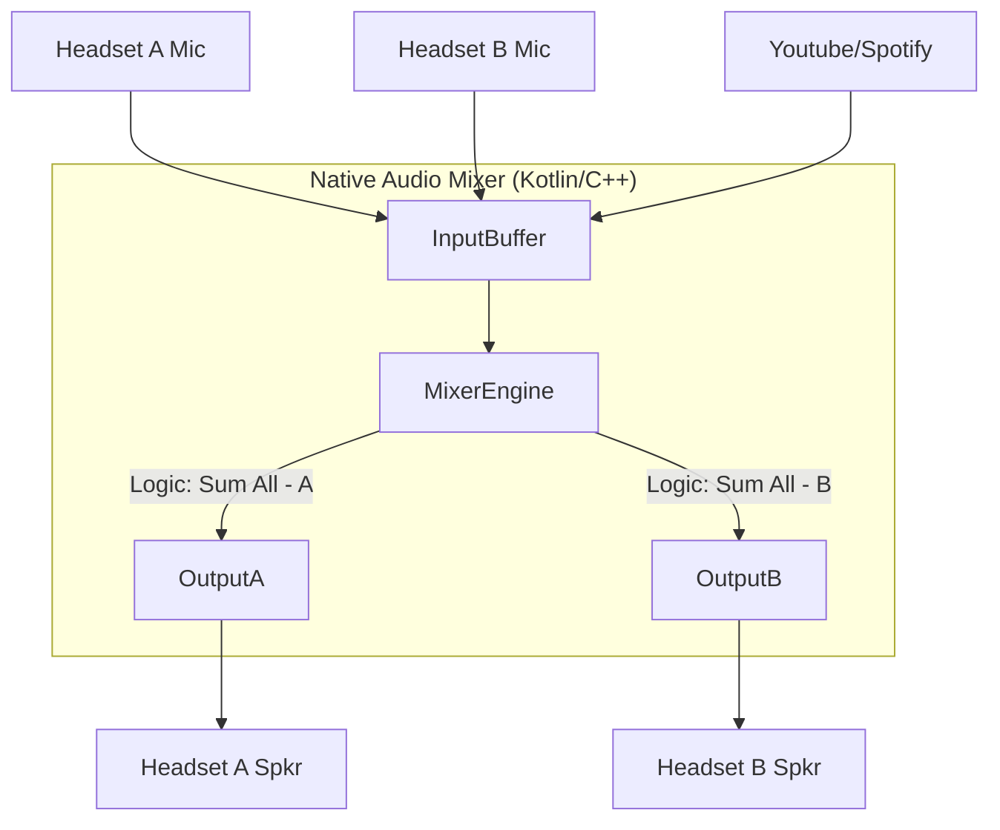

# walkie_talkie

The Walkie-Talkie app is a simple Android app that allows users to connect multiple bluetooth headsets to the phone
and send audio between the headsets without need of any internet connection.

## Restrictions

**The Bluetooth "Single-SCO" Bottleneck**
Standard Bluetooth (Classic) on most Android phones only supports **one** active bidirectional audio channel (HFP/HSP) at a time. While you can *pair* multiple headsets, the OS typically routes audio to only one "Active" device.

To achieve your goal of routing distinct audio to multiple headsets simultaneously, you must rely on **Bluetooth LE Audio (Low Energy Audio)** with **BIS (Broadcast Isochronous Streams)** or **CIS (Connected Isochronous Streams)**. This requires Android 13+ (API 33) and headsets that specifically support LE Audio/Auracast.

*The design below assumes we are building for this modern standard or using a low-level native workaround (NDK/Oboe) to attempt stream splitting, though the latter is hardware-dependent.*

-----

### High-Level Architecture (HLD)

The application will follow a **Layered Architecture**. Since Flutter cannot handle low-level audio stream routing or raw Bluetooth packet manipulation directly, the "Heavy Lifting" must be done in the Android Native layer (Kotlin/C++), with Flutter acting strictly as the UI and Control plane.

[Image of layered software architecture diagram]

#### A. The Layers

1.  **Presentation Layer (Flutter):**
      * Handles User Inputs (Rename devices, Mute toggle, Volume sliders).
      * Visualizes connection status and audio levels (VU meters).
      * Persists user preferences (Device Names).
2.  **Bridge Layer (MethodChannels & EventChannels):**
      * Communication pipe between Dart and Kotlin.
      * Flutter sends commands: `connect(macAddress)`, `setRouting(matrix)`.
      * Native sends events: `onAudioLevelChange`, `onDeviceConnected`.
3.  **Service Layer (Android Native - Kotlin):**
      * **Foreground Service:** Ensures the app runs even when the screen is off.
      * **Connection Manager:** Manages Bluetooth LeAudio connections.
      * **Audio Engine:** Creates the "Mix-Minus" routing.
4.  **Hardware Layer (HAL):**
      * Bluetooth Radio.
      * Audio Flinger (Android Audio System).

-----

### The Audio Routing Engine (The "Pipe")

This is the core logic. To prevent users from hearing their own voice (echo), we need a **Mix-Minus Matrix**.

**Concept:**
If User A, B, and C are connected:

  * **Headset A hears:** (B + C + Phone Media) - (A's Input).
  * **Headset B hears:** (A + C + Phone Media) - (B's Input).

[Image of audio matrix mixer diagram]

**Logical Flow:**

1.  **Capture:** The app spins up an `AudioRecord` instance for each input source (if hardware allows simultaneous capture) or a single Multi-Channel input.
2.  **Buffer:** Raw PCM data is stored in circular buffers.
3.  **Mixer:** The loop sums the audio bytes.
4.  **Distribution:** The `AudioTrack` writes the mixed bytes to specific device IDs.

-----

### Proposed UI/UX Design

The requirement is "incredibly user-friendly." We should avoid technical jargon.

**Screen 1: The "Command Center" (Dashboard)**

  * **Central Hub Visual:** A graphic of the phone in the center.
  * **Orbiting Satellites:** Headsets appear as circles orbiting the phone.
  * **Status Indicators:**
      * Green Ring: Connected & Active.
      * Grey Ring: Disconnected.
      * Pulse Animation: User is speaking.
  * **Quick Controls:** Tap a headset to open its drawer.

**Screen 2: Device Drawer (Bottom Sheet)**

  * **Rename Field:** Text box pre-filled with "Bluetooth-XYZ", editable to "Fred".
  * **Routing Toggle:** A switch labeled "Send Phone Audio" (enables/disables media piping).
  * **Volume Slider:** Independent gain control for that user.

**Screen 3: Discovery Mode**

  * "Radar" animation scanning for devices.
  * Simple "Tap to Connect" cards.

-----

### Component Diagrams

#### System Sequence Diagram (Connection & Rename)

#### Audio Processing Flow

-----

### Recommended Tech Stack & Libraries

Since this requires offline capability and high performance, we minimize cloud dependencies.

#### Flutter (Dart) Libraries

1.  **`flutter_bloc`**: For state management. Essential for handling the complex states of multiple device connections and audio levels.
2.  **`hive` & `hive_flutter`**: A lightweight, NoSQL local database.
      * *Usage:* Storing the mapping between MAC addresses and user-friendly names (e.g., `{"AA:BB:CC": "Fred"}`).
3.  **`permission_handler`**: To gracefully handle Bluetooth Connect/Scan and Microphone permissions on Android 13+.
4.  **`google_fonts`**: For clean, modern typography in the UI.

#### Android Native (Kotlin/Gradle) Libraries

1.  **`Android Bluetooth LE Audio API`**: (Native Android Framework). You cannot use a generic Flutter Bluetooth plugin for *streaming audio*. You must use the native `BluetoothLeAudio` and `BluetoothManager` classes.
2.  **`Oboe` (C++)**: High-performance audio library by Google.
      * *Usage:* Java/Kotlin audio APIs (`AudioTrack`) might introduce too much latency for a walkie-talkie app. Oboe allows you to write the audio mixing logic in C++ for near-zero latency.
3.  **`Gson`**: For serializing complex data objects to send back to Flutter via MethodChannels.

### Development Roadmap

1.  **Phase 1 (Proof of Concept):** Build a native Android app that simply connects two LE Audio devices and plays a sine wave to both simultaneously. (Verify hardware support).
2.  **Phase 2 (The Bridge):** Set up the Flutter UI and the MethodChannel infrastructure. Implement the scanning logic.
3.  **Phase 3 (The Mixer):** Implement the C++/Kotlin audio engine to capture mic input and route it.
4.  **Phase 4 (UX Polish):** Implement the renaming persistence and the "Phone Audio" injection toggle (which requires capturing system audio via `AudioPlaybackCaptureConfiguration` - *Note: this restricts capturing to apps that allow it, e.g., YouTube might block capture due to DRM*).

### Important Technical "Gotcha"

**DRM and Phone Audio Injection:**
Requirement \#3 mentions piping phone audio (e.g., YouTube). Android prevents apps from capturing the audio of other apps (like Spotify or YouTube) easily due to copyright/DRM.

  * **Workaround:** You cannot "record" YouTube and pipe it. You must rely on **Android Audio Sharing (Auracast)** logic where the OS handles the mixing. Your app would simply manage the *control* signals, not the actual audio bytes of the YouTube video.