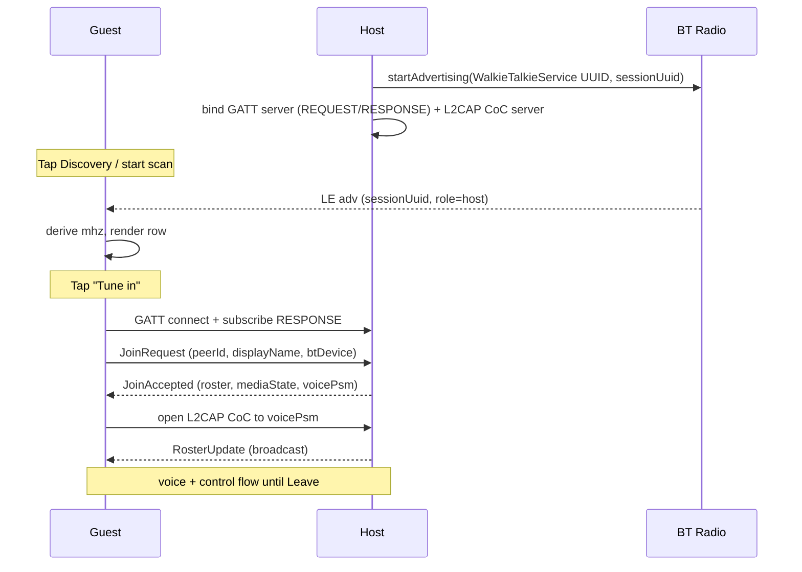
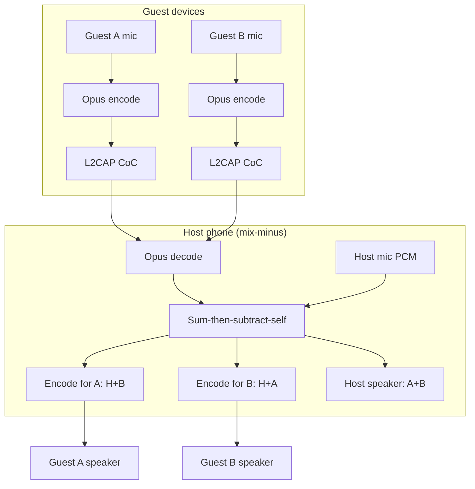

# walkie_talkie

Frequency is an Android walkie-talkie app: open the app, "tune in" to someone
nearby's frequency, and you're on a shared voice channel with everyone else
tuned to the same one. No internet, no accounts, no cloud — just Bluetooth LE
between phones in the same room.

> **Android-only by design.** iOS/desktop scaffolding has been removed from
> this repo. The native voice plane (Oboe + L2CAP CoC) requires Android APIs
> that have no equivalent on other platforms, and the owner has confirmed v1
> will never ship elsewhere. See
> [docs/protocol.md § Out of scope](docs/protocol.md#out-of-scope).

## Transport

Voice and control both ride on **Bluetooth LE**, in a star topology with one
designated **host** per frequency. The control plane is GATT (small JSON
messages); the voice plane is **L2CAP CoC** carrying **Opus**-encoded frames.
The full wire format — message kinds, fragmentation, reconnect rules, voice
frame layout — lives in [docs/protocol.md](docs/protocol.md). The README
below covers the architecture and the team-facing roadmap; the protocol doc
is the contract.

> **Note:** an earlier version of this README pitched Bluetooth LE Audio
> CIS / BIS as the voice transport. That was walked back: consumer Android
> phones are LE Audio *sources*, not Auracast sinks, so phone-to-phone LE
> Audio doesn't work in practice. L2CAP CoC + Opus is the v1 voice plane.
> See [docs/protocol.md § Voice plane](docs/protocol.md#voice-plane).

-----

## High-Level Architecture (HLD)

The application follows a **Layered Architecture**. Flutter handles UI and
control-plane state; the Android native layer (Kotlin + a thin C++ mixer)
handles BLE radio, L2CAP sockets, mic capture, and Opus.

### Layers

1.  **Presentation Layer (Flutter):**
    * Onboarding, Discovery, and the Room screen.
    * Renders roster, talking-rings, mute / push-to-talk, shared-media
      controls.
    * Persists display name + stable `peerId` via Hive
      ([lib/services/identity_store.dart](lib/services/identity_store.dart)).
2.  **State Layer (BLoC / Cubit):**
    * [`DiscoveryCubit`](lib/bloc/discovery_cubit.dart) drives the
      Discovery screen.
    * [`FrequencySessionCubit`](lib/bloc/frequency_session_cubit.dart) owns
      room-level state (roster, mute, talking, media) and emits
      protocol-shaped messages.
3.  **Bridge Layer (MethodChannels & EventChannels):**
    * Communication pipe between Dart and Kotlin
      ([MainActivity.kt](android/app/src/main/kotlin/com/elodin/walkie_talkie/MainActivity.kt)).
    * Today: `scanDevices` / `connectDevice` / `disconnectDevice` methods
      and `deviceDiscovered` events drive the headset-routing manager.
      [audio_service.dart](lib/services/audio_service.dart) is the Dart
      side of that surface.
    * Phase 2 (planned, see roadmap): the BLE control-plane bridge —
      Frequency-shaped methods like `startAdvertising`, `connectToHost`,
      and `setMuted`, plus events like `onPeerDiscovered` and
      `onJoinAccepted`. Tracked under
      [#44](https://github.com/ElodinLaarz/walkie-talkie/issues/44).
4.  **Service Layer (Android Native — Kotlin):**
    * **Foreground Service**
      ([WalkieTalkieService.kt](android/app/src/main/kotlin/com/elodin/walkie_talkie/WalkieTalkieService.kt))
      keeps the mic + radio alive when the screen is off.
    * **BT headset routing** today
      ([BluetoothLeAudioManager.kt](android/app/src/main/kotlin/com/elodin/walkie_talkie/BluetoothLeAudioManager.kt))
      — pairs the user's headset and routes phone audio to it.
    * **BLE Connection Manager** (Phase 2) — LE advertise (host), scan
      (guest), GATT server / client, L2CAP CoC server / client. Not yet
      implemented; tracked in the Phase 2 issues below.
    * **Audio Engine** (Phase 3) — mic capture (Oboe), Opus encode/decode,
      mix-minus. Not yet implemented.
5.  **Hardware Layer:** Bluetooth radio, microphone, audio output.

-----

## The Audio Routing Engine (mix-minus, host-only)

To prevent everyone from hearing themselves echo, the **host** runs a
**mix-minus matrix**. The host is the only device that ever mixes audio;
guests just encode their own mic and decode whatever the host sends them.

**Concept** — for guests A and B connected to host H (the diagram below
matches this two-guest example; the same pattern scales to N guests):

  * **Headset A hears:**  H + B  *(A's own mic is subtracted)*
  * **Headset B hears:**  H + A  *(B's own mic is subtracted)*

**Logical flow:**

1.  **Capture.** Each peer records its own mic with Oboe (~10-ms callbacks).
2.  **Encode + uplink (guests).** Each guest encodes 20-ms PCM frames to
    Opus locally and writes them over its L2CAP CoC to the host. The host
    captures its own mic locally as PCM and does **not** uplink to itself.
3.  **Mix (host only).** The host decodes incoming guest Opus streams,
    mixes them with its own local mic PCM, and produces *N* output
    streams — one per guest, each with that guest's contribution removed.
4.  **Distribute.** The host re-encodes each output stream to Opus and
    writes it back over that guest's L2CAP CoC.
5.  **Decode + render.** Each guest decodes the host's stream and plays it
    through Oboe to the active audio device (phone speaker or paired
    Bluetooth headset, see
    [BluetoothLeAudioManager.kt](android/app/src/main/kotlin/com/elodin/walkie_talkie/BluetoothLeAudioManager.kt)).

The host's *own* mic is added into every guest's output but not into its
own (the host hears guests but not itself, same rule). Shared media bed
(YouTube / Spotify) is **not** mixed in by the host — see
[docs/protocol.md § Shared media](docs/protocol.md#shared-media): each
peer plays its own copy, the host only broadcasts control signals.

-----

## UI / UX

The current screens (matching what's checked in under [lib/screens](lib/screens)):

**Onboarding** — request the BT + mic permissions and capture a display name.
Persisted to Hive so this only happens once.

**Discovery** — radar-style list of nearby hosts advertising the Frequency
service UUID. Each row shows host name + cosmetic MHz dial reading. Tap
*Tune in* to send a `JoinRequest`. Includes an identity chip that opens a
rename sheet for changing your display name later.

**Frequency Room** — central frequency dial, orbiting peer chips with
talking-rings, push-to-talk button, mute toggle, shared-media controls,
and a *Leave* button. Joining is implicit — the host's `JoinAccepted`
delivers the roster + current `mediaState` so the room renders fully
populated on entry.

-----

## Component Diagrams

### System sequence diagram (host advertise → guest tune in)

```mermaid
sequenceDiagram
    participant Guest
    participant Host
    participant BTRadio as BT Radio

    Host->>BTRadio: startAdvertising(WalkieTalkieService UUID, sessionUuid)
    Host->>Host: bind GATT server (REQUEST/RESPONSE) + L2CAP CoC server
    Note over Guest: Tap Discovery / start scan
    BTRadio-->>Guest: LE adv (sessionUuid, role=host)
    Guest->>Guest: derive mhz, render row
    Note over Guest: Tap "Tune in"
    Guest->>Host: GATT connect + subscribe RESPONSE
    Guest->>Host: JoinRequest (peerId, displayName, btDevice)
    Host-->>Guest: JoinAccepted (roster, mediaState, voicePsm)
    Guest->>Host: open L2CAP CoC to voicePsm
    Host-->>Guest: RosterUpdate (broadcast)
    Note over Guest, Host: voice + control flow until Leave
```

### Audio processing flow

```mermaid
graph TD
    subgraph "Guest devices"
        MicA[Guest A mic] --> OpusA[Opus encode]
        MicB[Guest B mic] --> OpusB[Opus encode]
        OpusA --> L2CAPInA[L2CAP CoC]
        OpusB --> L2CAPInB[L2CAP CoC]
    end

    subgraph "Host phone (mix-minus)"
        L2CAPInA --> Decode[Opus decode]
        L2CAPInB --> Decode
        Decode --> Mixer[Sum-then-subtract-self]
        MicH[Host mic PCM] --> Mixer
        Mixer --> EncA[Encode for A: H+B]
        Mixer --> EncB[Encode for B: H+A]
        Mixer --> SpkH[Host speaker: A+B]
    end

    EncA --> SpkA[Guest A speaker]
    EncB --> SpkB[Guest B speaker]
```

-----

## Tech Stack & Libraries

### Flutter (Dart)

1.  **`flutter_bloc`** — state management for Discovery and the Frequency
    session cubits.
2.  **`hive` & `hive_flutter`** — local-only persistence for `peerId` and
    display name. No cloud sync (intentional).
3.  **`permission_handler`** — Bluetooth scan / connect / advertise + mic
    permissions. The runtime asks happen during onboarding
    ([lib/services/onboarding_permission_gateway.dart](lib/services/onboarding_permission_gateway.dart)).
4.  **`google_fonts`** — typography.

### Android Native (Kotlin / C++)

The libraries / APIs below are the planned native surface for Phases 2-3
(see roadmap). Today's native code under `android/app/src/main/kotlin/`
is the headset-routing manager
([BluetoothLeAudioManager.kt](android/app/src/main/kotlin/com/elodin/walkie_talkie/BluetoothLeAudioManager.kt))
plus the foreground service shell — none of the BLE control / L2CAP / Opus
pieces are wired up yet.

1.  **AndroidX Bluetooth APIs** *(Phase 2)* — `BluetoothLeAdvertiser`,
    `BluetoothLeScanner`, `BluetoothGattServer` / `BluetoothGatt`, and
    `BluetoothSocket` opened in L2CAP CoC mode
    (`createInsecureL2capChannel` / `listenUsingInsecureL2capChannel`,
    **API 29+ / Android 10+**). The voice plane is L2CAP CoC + Opus,
    **not** LE Audio CIS / BIS — see the transport note above.
2.  **`libopus`** (C / NDK) *(Phase 3)* — voice codec, narrowband /
    wideband, 20-ms frames at 24 kbps. Per-peer encode on guests, decode +
    re-encode on the host's mix-minus.
3.  **`Oboe`** (C++) *(Phase 3)* — low-latency mic capture and playback.
    Java-side `AudioRecord` / `AudioTrack` introduce too much latency for
    a walkie-talkie feel.
4.  **`kotlinx.serialization`** *(Phase 2)* — JSON for the GATT control
    plane (preferred over Gson for compile-time safety on a Kotlin-first
    codebase).

-----

## Development Roadmap

This roadmap mirrors the open issues in
[github.com/ElodinLaarz/walkie-talkie/issues](https://github.com/ElodinLaarz/walkie-talkie/issues);
that's the source of truth, this is the friendly map.

### Phase 1 — Dart skeleton ✅ done

UI screens, onboarding + permissions, BLoC state, Hive persistence
(`peerId` + display name), wire-protocol Dart stubs (framing,
sequence filter, message envelope, voice-frame), foreground service shell.

### Phase 2 — Native BLE control plane (in flight)

End-to-end host advertise → guest connect → JoinAccepted snapshot, all on
real radios.

* [#38](https://github.com/ElodinLaarz/walkie-talkie/issues/38) Onboarding asks for `BLUETOOTH_ADVERTISE`.
* [#41](https://github.com/ElodinLaarz/walkie-talkie/issues/41) Native LE advertiser (host).
* [#42](https://github.com/ElodinLaarz/walkie-talkie/issues/42) Native GATT server with REQUEST/RESPONSE characteristics.
* [#43](https://github.com/ElodinLaarz/walkie-talkie/issues/43) Native GATT client + connect flow on the guest.
* [#44](https://github.com/ElodinLaarz/walkie-talkie/issues/44) `BleControlTransport` cubit bridging Dart ↔ native.
* [#45](https://github.com/ElodinLaarz/walkie-talkie/issues/45) Negotiated GATT MTU plumbing.
* [#37](https://github.com/ElodinLaarz/walkie-talkie/issues/37) Carry `sessionUuid` + BT MAC end-to-end through discovery.
* [#39](https://github.com/ElodinLaarz/walkie-talkie/issues/39) Host-side session bootstrap (mint `sessionUuid`, self-seed `JoinAccepted`).
* [#40](https://github.com/ElodinLaarz/walkie-talkie/issues/40) Replace mock roster + media in the room screen with cubit state.

### Phase 3 — Voice plane

Real audio between two phones.

* [#46](https://github.com/ElodinLaarz/walkie-talkie/issues/46) Native L2CAP CoC server (host) + client (guest).
* [#47](https://github.com/ElodinLaarz/walkie-talkie/issues/47) Native libopus encoder + decoder.
* [#48](https://github.com/ElodinLaarz/walkie-talkie/issues/48) Real mix-minus across multiple peers.
* [#49](https://github.com/ElodinLaarz/walkie-talkie/issues/49) Per-peer voice-frame seq tracking with stuck-producer prune.
* [#50](https://github.com/ElodinLaarz/walkie-talkie/issues/50) Voice-activity detection + outbound `TalkingState` messages.

### Phase 4 — Reliability

* [#51](https://github.com/ElodinLaarz/walkie-talkie/issues/51) Heartbeats + dirty-disconnect detection.
* [#53](https://github.com/ElodinLaarz/walkie-talkie/issues/53) `SignalReport` on a 10s timer (replaces the demo weak-signal toast).
* [#55](https://github.com/ElodinLaarz/walkie-talkie/issues/55) Android Audio Focus management (phone calls + Spotify clashes).
* [#56](https://github.com/ElodinLaarz/walkie-talkie/issues/56) Graceful auto-reconnect for transient drops (≤30s).
* [#57](https://github.com/ElodinLaarz/walkie-talkie/issues/57) Permissions revocation handling (mic / BT revoked while in-room).

### Phase 5 — Release polish

* [#34](https://github.com/ElodinLaarz/walkie-talkie/issues/34) Release signing config (replace debug-key fallback).
* [#35](https://github.com/ElodinLaarz/walkie-talkie/issues/35) CI: build & run native `mixer_test` (and delete the checked-in binary).
* [#36](https://github.com/ElodinLaarz/walkie-talkie/issues/36) Delete iOS / macOS / Windows / Linux scaffolding (Android-only v1).
* [#52](https://github.com/ElodinLaarz/walkie-talkie/issues/52) Verify foreground notification configuration in `WalkieTalkieService`.

Out of scope for v1: encryption beyond LE pairing, host handover, mesh
topology, > 12 peers per room. See
[docs/protocol.md § Out of scope](docs/protocol.md#out-of-scope).

-----

## Important Technical "Gotcha"

**DRM and shared-media injection.** The shared-media controls (play / pause /
skip) propagate as **control signals only**. Each peer plays its own local
copy of YouTube Music / Spotify / etc.; the host doesn't capture and rebroadcast
the audio because Android blocks cross-app capture of DRM'd media. This is
also why media isn't mixed into the host's mix-minus: there's nothing to mix.
See [docs/protocol.md § Shared media](docs/protocol.md#shared-media) for the
exact echo / reconciliation rules.
